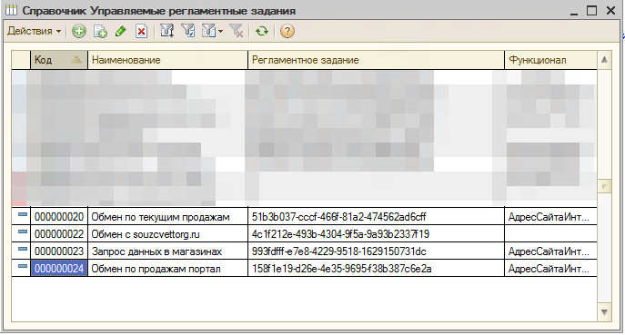
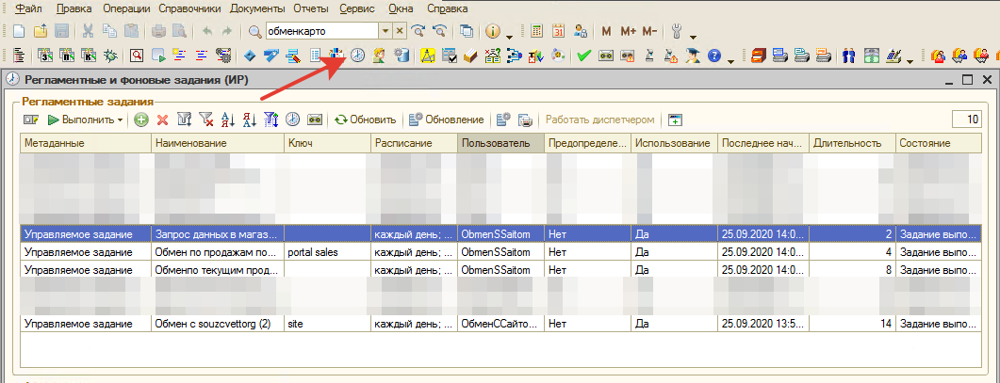
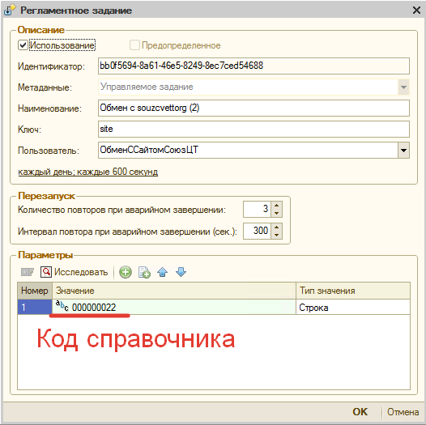
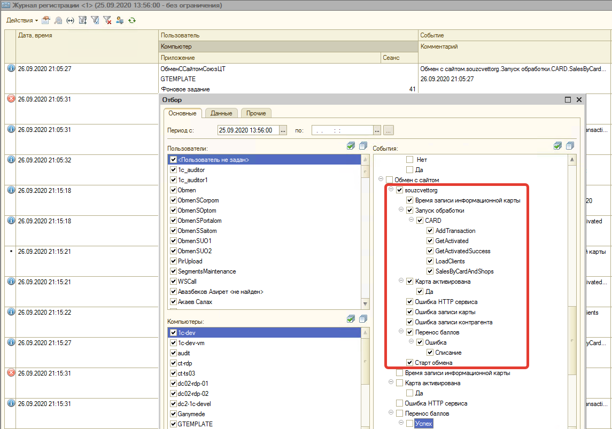
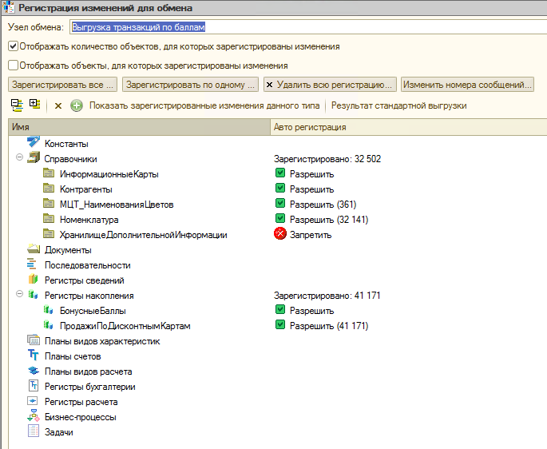

# todo: при смене телефона, должно это прогрузиться в 1С

# Обмен УТ Управленки с магазинами и сайтами

На данный момент обмен с сайтами запускаемый в обработках разделен на 2е. По аналогии с первой, вторая обработка также находится в УТ Управленка - Внешние обработки:
1. Старая обработка осталась без изменений "Обмен с сайтами" (УП0000064)
2. Новая обработка "Обмен с souzcvettorg.ru" (УП0000079)

Обработки запускаются через так называемый механизм "управлямых" регламентных заданий. Это созданные в Предприятии регламентные задания (не добавленные в конфигурацию). Которые вызываются при помощи созданного в конфигураторе регламентного задания "Управляемое задание" (МЦТ_УправляемоеЗадание). В конфигурации из модуля МЦТ_РегламентныеЗадания вызывается процедура ВыполнитьУправляемоеРегламентноеЗадание, в которую передается значение типа - Строка, которое должено соответствовать полю Код элемента справочника "Управляемые регламентные задания" (МЦТ_УправляемыеРегламентныеЗадания). 

Для обмена у нас присутствуют 4 управляемых регламентных задания в Предприятии. Которые выполняют код 1С, хранящийся в элементах справочника Управляемые регламентные задания с кодами: 000000020, 000000022, 000000023, 000000024.

Найти соответствующие регламентные задания, связанные с данным справочником можно через обработку Регламентные и фоновые задания (панель Инструменты разработчика). Среди регламентных заданий нужно установить отбор по Метаданным - Управляемое задание, которое описано выше.

Открыв регламентное задание из обработки, внизу группа Параметры, в которой первым аргументом указан номер с типом Строка, соответствующий коду справочника "Управляемые регламентные задания".

3 старых регламентных задания и элемента справочника с кодами: 000000020, 000000023, 000000024 отвечают за получение из магазина текущих продаж, выгрузку их на веб-сервер по адресам: selling.cvetcom.com, portal.ct.main. И используют одну и туже обработку "Обмен с сайтами" (УП0000064).

## Новая обработка обмена с сайтом souzcvettorg.ru

Из старой была создана новая обработка, чтобы больше не нарушать работу старого функционала, которая хранится в справочнике внешних обработок "Обмен с souzcvettorg.ru" (УП0000079). За ее работу отвечает управляемое регламентное задание "Обмен с souzcvettorg (2)", выполняемая под пользователем "ОбменССайтомСоюзЦТ". 

### Журнал регистрации

За счет того что обработка выполняется под пользователем с выделенной только под него учетной записью 1С, мы можем удобно фильтровать записи журнала регистрации в по данному пользователю.
Также в новой обработке прописано логирование по адресу "Обмен с сайтом.souzcvettorg", что позволяет отфильтровать записи в журнале регистрации по Данным с вложенностью: Обмен с сайтом -> souzcvettorg.

### Описание работы обработки

Обработка запускается со следующими параметрами, имена которых соответствуют каталогам на веб-сайте:
1. CARD.GetActivated - получает ранее активированные карты и добавляет по ним информацию, полученную с сайта в виде номера телефона, ФИО и обновляет наименование информационной карты, контрагента, контактную информацию в 1С. Подробнее:

    1.	Карты, получаемые с веб-сервера, проверяются являются ли они активированы, расчет на сервере и содержание ФИО пришедшего с сайта в имени информационной карты
    2.	Для информационной карты проставляются поля ВладелецКарты, Контрагент сопоставленные по коду контрагента, пришедшего с веб-сервера (поле КодКонтрагента)
    3.	При отсутствии записи телефона в базе 1С, будет записываться

2. CARD.LoadClients - Выгружает измененных информацию по картам, контрагентам и телефонам на веб-сервер.
3. CARD.AddTransaction - Выгружает движения по продажам из ОРП и документа Начисления и списания бонусных баллов (с комметарием «…Чек ККМ…» на сайт CARD.SalesByCardAndShops (доработка от 09-2020). Выгружает бонусные баллы по покупкам с картами лояльности. В одной таблице выгружается информация по магазинам, информационным картам (секретный код активации, штрихкод) и суммам продаж. Продажи тянутся из документов отчеты о розничных продажах. По магазину выгружается его поле Код и внутренний УИД.
4. CARD.SalesByCardAndShops (доработано 09-2020) - Выгружает бонусные баллы по покупкам с картами лояльности. В одной таблице выгружается информация по магазинам, информационным картам (секретный код активации, штрихкод) и суммам продаж. Продажи тянутся из документов отчеты о розничных продажах. По магазину выгружается его поле Код и внутренний УИД. 

## Планы обмена

Также частью данного обмена с сайтами является план видов обмена "Обмен с WEB-сайтом товарами". Узел обмена "Выгрузка транзакций по баллам" (BTR).

Задействованные в обмене метаданные:

1. Справочники: Инфомрационные карты и контрагенты
2. Регистр накопления Бонусные баллы

Как можно судить по накопленным данным в других объектах метаданных, в обмене они не участвуют.