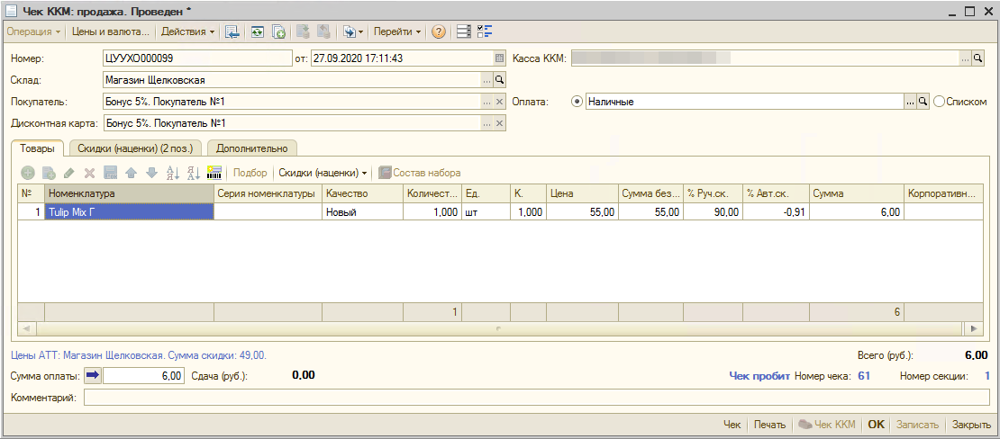
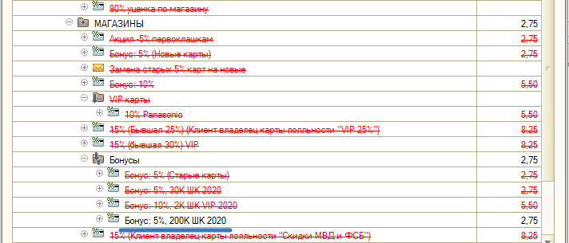
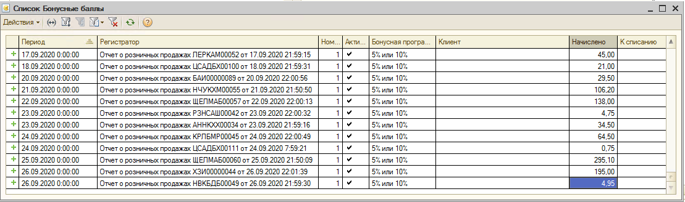
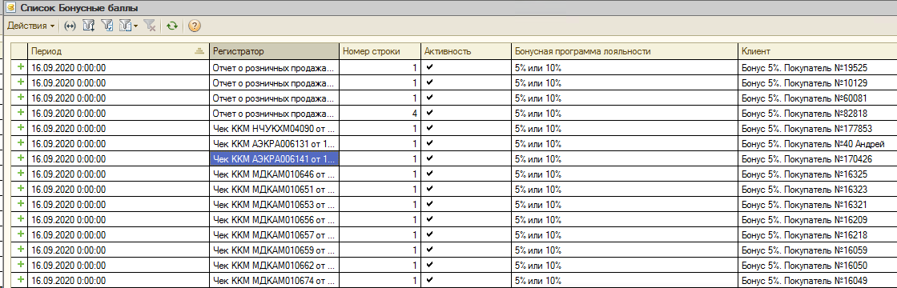
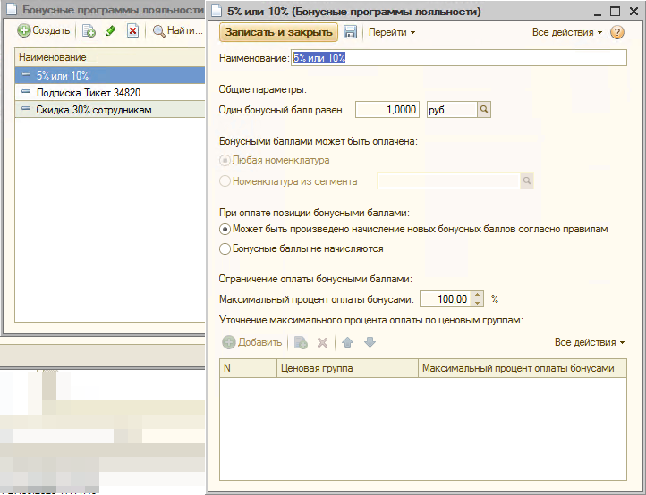
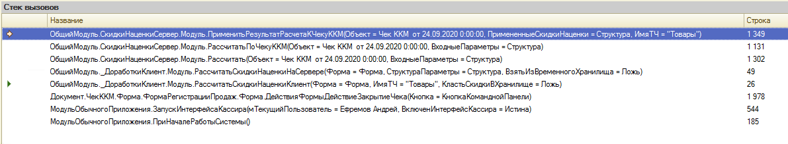

## Проблемы

#### При наличии бонусной карты, клиенту падают на карту бонусы по цене позиции, без учета скидок, рассчитанных по ней



Форма Примененные скидки для строки вызывается из документа Чек ККМ, меню над табличной частью Товары Скидки (наценки) - Открыть информацию о скидка.

Видим бонусы рассчитаны только от цены позиции. 5% от всей суммы без скидки - 55 руб. -> 2,75 руб.



Причина в рассчете бонусных баллов на сервере, куда из базы магазина передается цена товара без учета ручной скидки.

См. конфигурацию магазинов, Общий модуль "СкидкиНаценкиСервер", Функция РассчитатьПоЧекуККМ

```java
    ВЫБРАТЬ
		Товары.КлючСвязи            КАК КлючСвязи,
		%ПоляНабора%
		Товары.Номенклатура         КАК Номенклатура,
		Товары.ХарактеристикаНоменклатуры       КАК ХарактеристикаНоменклатуры,
		Товары.СерияНоменклатуры       			КАК СерияНоменклатуры,
		Товары.Качество             КАК Качество,
		Товары.Количество           КАК Количество,
		Товары.Цена                 КАК Цена
```

#### Пристствует проблема с пустым клиентом, по которому начисляются бонусы

Не проставляется Клиент в регистре Бонусных баллов.



#### Документ Начисление и списание бонусных баллов

При закрытия документа Чек ККМ:

- В базе магазина клиенту начисляются бонусные баллы с помощью документа Чек ККМ по регистру Боусные баллы. При формировании Отчета о розничных продажах Чеки ККМ распроводятся, а бонусы переходят в документ ОРП.
  

- На сервере (если он доступен) в Управленке создается документ Начисления и списания бонусных баллов, которые отправляются на сайт. При получении Управленкой Отчета о розничных продажах, начисления по бонусам регистрируются данным документом, а "старые" документы Начисления и списания бонусных баллов удаляются. См. в конфигурации Управленки общий модуль Доработки:
  ```java
  ЗапросНаУничтожениеВременныхБаллов.Текст =
  "ВЫБРАТЬ
  	ОтчетОРозничныхПродажахЧеки.НомерЧекаККМ,
  	ОтчетОРозничныхПродажахЧеки.НомерСменыККМ,
  ...
  	ПОМЕСТИТЬ Чеки
  	ИЗ
  		Документ.ОтчетОРозничныхПродажах.Чеки КАК ОтчетОРозничныхПродажахЧеки
  ...
  	ВЫБРАТЬ
  		НачислениеИСписаниеБонусныхБаллов.Ссылка
  	ИЗ
  		Документ.НачислениеИСписаниеБонусныхБаллов КАК НачислениеИСписаниеБонусныхБаллов
  			ВНУТРЕННЕЕ СОЕДИНЕНИЕ Чеки КАК Чеки
  			ПО НачислениеИСписаниеБонусныхБаллов.МЦТ_КассаККМ = Чеки.КассаККМ
  				И НачислениеИСписаниеБонусныхБаллов.МЦТ_НомерЧекаККМ = Чеки.НомерЧекаККМ
  				И НачислениеИСписаниеБонусныхБаллов.МЦТ_НомерЧека1С = Чеки.Номер
  				И НачислениеИСписаниеБонусныхБаллов.МЦТ_НомерСменыККМ = Чеки.НомерСменыККМ";
  Результат = ЗапросНаУничтожениеВременныхБаллов.Выполнить();
  Выборка = Результат.Выбрать();
  Пока Выборка.Следующий() Цикл
  	Выборка.Ссылка.ПолучитьОбъект().Удалить();
  КонецЦикла;
  ```

Документ Начисления и списания бонусных баллов формируется на сервере в случае если были рассчитаны скидки и занесены в табличную часть Бонусные Баллы документа Чек ККМ.

## Как проходит расчет скидок и бонусов

#### Справочник бонусные программы лояльности содержит информацио о рассчетах.

Также форма Оплата Бонусными Баллами данного справочника вызывается при расчете бонусами при закрытии чека ККМ.



#### Разветвление при расчете скидок на сервере или в магазине

Общий модуль СкидкиНаценкиСервер Функция РассчитатьПоЧекуККМ

```java
Если ВходныеПараметры.Свойство("РасчетНаСервереСкидок") И ВходныеПараметры.РасчетНаСервереСкидок Тогда
	ПримененныеСкидкиНаценки = РасчетНаСервереСкидок(ПараметрыРасчета, ВходныеПараметры);
Иначе
	ПримененныеСкидкиНаценки = РассчитатьДеревоСкидокНаценок(ПараметрыРасчета, ВходныеПараметры);
КонецЕсли;
```

#### То, где будет проходить расчет скидок

Определяется в общем модуле \_ДоработкиКлиент Процедура РассчитатьСкидкиНаценкиКлиент

```java
РасчетНаСервереСкидок = РасчетНаСервереОдноразовыеСкидки(Форма);
```

Расчет на сервере производится в случае если информационная карта присутствует и в ней указано, что производится расчет на сервере.

### Где искать

Стек вызова:



```java
1. ОбщийМодуль.СкидкиНаценкиСервер.Модуль.ПрименитьРезультатРасчетаКЧекуККМ(Объект = Чек ККМ  от 24.09.2020 0:00:00, ПримененныеСкидкиНаценки = Структура, ИмяТЧ = "Товары")	1 349
2. ОбщийМодуль.СкидкиНаценкиСервер.Модуль.РассчитатьПоЧекуККМ(Объект = Чек ККМ  от 24.09.2020 0:00:00, ВходныеПараметры = Структура)	1 131
3. ОбщийМодуль.СкидкиНаценкиСервер.Модуль.Рассчитать(Объект = Чек ККМ  от 24.09.2020 0:00:00, ВходныеПараметры = Структура)	1 302
4. ОбщийМодуль._ДоработкиКлиент.Модуль.РассчитатьСкидкиНаценкиНаСервере(Форма = Форма, СтруктураПараметры = Структура, ВзятьИзВременногоХранилища = Ложь)	49
5. ОбщийМодуль._ДоработкиКлиент.Модуль.РассчитатьСкидкиНаценкиКлиент(Форма = Форма, ИмяТЧ = "Товары", КластьСкидкиВХранилище = Ложь)	26
6. Документ.ЧекККМ.Форма.ФормаРегистрацииПродаж.Форма.ДействияФормыДействиеЗакрытиеЧека(Кнопка = КнопкаКоманднойПанели)	1 978
7. МодульОбычногоПриложения.ЗапускИнтерфейсаКассира(мТекущийПользователь = Ефремов Андрей, ВключенИнтерфейсКассира = Истина)	544
8. МодульОбычногоПриложения.ПриНачалеРаботыСистемы()	185
```

Общий модуль СкидкиНаценкиСервер, процедура ПрименитьРезультатРасчетаКЧекуККМ начисляет бонусные баллы в табличную часть БонусныеБаллы документа ЧекККМ для создания на сервере документа Начисления и списания бонусных баллов.

```java
Если Не ЗначениеЗаполнено(Объект.ВладелецДисконтнойКарты) Тогда
	Возврат;
КонецЕсли;
...
Объект.БонусныеБаллы.Очистить();
БонусныеБаллы = Новый ТаблицаЗначений;
...
	Для Каждого СтрокаТЧ Из Объект.Товары Цикл

		Если ИспользуетсяОдновременноеСписаниеИНачисление Тогда

			Начислено = 0;
			НайденныеСтроки = НачисленныеБонусныеБаллы.НайтиСтроки(Новый Структура("КлючСвязи", СтрокаТЧ.КлючСвязи));
			Для Каждого СтрокаНачислениеБаллов Из НайденныеСтроки Цикл

				НоваяСтрока = БонусныеБаллы.Добавить();
				ЗаполнитьЗначенияСвойств(НоваяСтрока, СтрокаНачислениеБаллов);

```

В случае начисления бонусных баллов на карту, они передаются в Управленку, создавая документ Начисления и списания бонусных баллов
Модуль объекта документ ЧекККМ, процедура ДвиженияПоБалламНаСервереСкидок()

```java
СуммаБаллов = БонусныеБаллы.Итог("СуммаБонусныхБаллов") - Товары.Итог("СуммаБонусныхБалловКСписанию");
...
ИсполняемыйКод = "ВозвращаемоеЗначение = ""Успешно"";" + СимволПереноса;
ИсполняемыйКод = ИсполняемыйКод + 	"НачислениеСписание = Документы.НачислениеИСписаниеБонусныхБаллов.СоздатьДокумент();" + СимволПереноса;
ИсполняемыйКод = ИсполняемыйКод + 	"НачислениеСписание.Дата = " + _Доработки.ПреобразоватьПараметрВСтроку(Дата) + ";" + СимволПереноса;
ИсполняемыйКод = ИсполняемыйКод + 	"НачислениеСписание.МЦТ_НомерЧекаККМ = """ + НомерЧекаККМ + """;" + СимволПереноса;
...
ХЗ = ВебСервис.Exec(ИсполняемыйКод);
```
