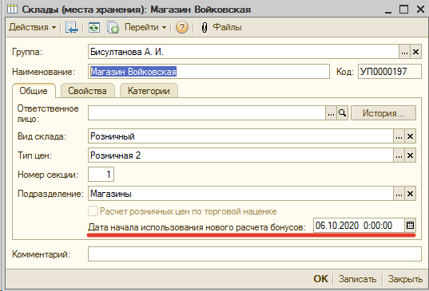
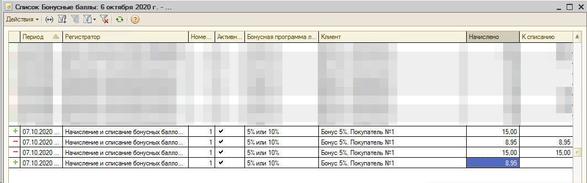

## Доработки рассчета бонусов, скидок и обмен магазин - управленка

### Сокращения, пояснения:

- "сервер" имеется ввиду сервер рассчета бонусов - Управленка, "клиент" - база магазина - "локальный" рассчет
- ОРП - Отчет о розничных продажах
- Выполнение обмена данными РИБ (Распределенная информационная база) - типовой обмен (Магазин - Узел обмена - Управленка)

### Новая реализация работы со скидками и бонусами (10-2020):

- Расчет бонусов по карте в новом механизме будет настраиваться не в справочнике Скидки/Наценки, а в справочнике БонусыПоКартам. При этом все скидки (акции и т.д.) будут по прежнему рассчитываться через справочник Скидок (механизм, перенесенный из УТ 11), т.к. этот функционал удовлетворяет текущим потребностям. Любые бонусные начисления по картам лояльности, настроенные в дереве Скидок учитываться не будут, не смотря на статус актуальности.

- Рассчет скидок, бонусов на клиенте / сервере:

  - Скидки будут всегда рассчитываться в базе магазина, т.к. в магазине есть все необходимые данные для рассчета
  - Запросы на сервер будут выполняться для:
    - Получения актуальных остатка баллов по карте. В случае не доступности сервера бонусы по карте лояльности будут получены локально. В случае, когда сервер доступен но в регистре на отправку бонусов находятся движения по данной карте лояльности, будут использоваться локальные данные бонусов

- Как в новом механизме, так и в старом остается проблема рассинхронизации бонусов по клиенту и серверу при обмене текущими бонусами (до закрытия смены) при работающем механизме веб-сервисов (Магазин - Управленка) и нерабочем типовом обмене через механизм РИБ.
- Чтобы включить расчет бонусов по новой системе для магазина, нужно в УО установить флаг
  

### Как работала система расчета скидок:

- И скидки и бонусы хранятся в справочнике Скидки (Наценки)
- При расчете бонус не учитываются скидки, примененные к позициям товаров/услуг и бонусы считаются от суммы всего документа
  - Поскольку отсутствует флажок Расчета бонусов с учетом дерева скидок из более новых версий конфигурации. Т.к. текущая система скидок из старой УТ 11, не была предназначена для расчета бонусов с учетом расчета дерева скидок
- В рассчете бонусов вообще не учитываются ручные скидки и оплата чека бонусными баллами
- Рассчет скидок на клиенте / сервере:

  - при использовании карты лояльности и бонусы и скидки рассчитываются сервером, при недоступности сервера скидидки, бонусы рассчитываются локально
  - при отсутсвии карты лояльности скидки, бонусы рассчитываются локально в базе магазина
  - после закрытия чека бонусы отправляются на сервер, в случае неудачи, бонусы поступят на сервер после закрытия смены и выполнения типового обмена

- В магазине актуальность бонусов поддерживают документы ЧекККМ, Отчет о розничных продажах. Чеки ККМ поддерживают остаток по бонусам в течении открытой смены, после закрытия смены, Чеки ККМ распроводятся и движения по бонусам делаются через ОРП
- В Управленке актуально бонусов подержививают документы Начисление и списание бонусных баллов, Отчет о розничных продажа. При поступлении ОРП в Управленку, Начисления и списания бонусных баллов распроводятся и движения по бонусам делаются через ОРП
- В случае списания бонусных баллов в количестве большем, чем начисления, будет создан
  спределенной информационной базы). После восстановления работы обмена РИБ, бонусы будут синхронизированы, без ошибок.
- При формировании ОРП, непереданные бонусы по чекам для передачи актуальных баллов по карте на сервер будут отменены

### Бонусные баллы по текущим продажам в открытой смене

- Бонусные баллы по текущим продажам передаются на сервер одним документом Начисления и списания бонусных баллов (Сумма начисления - Сумма списания).

  - При отрицательной сумме начисления - списания документ "Начисления и Списания бонусных баллов" будет с видом с Списание, при положительном - Начисление, если нуль, тогда документ не сформируется:

    1. Сумма чека 1035 руб., 35 руб оплачено баллами, 50 баллов начислено. В Управленку прилетает док. Начисления и списания бонусных баллов с видом Начисление = 15 рублям
    2. Сумма чека 10 руб., 9 оплачено баллами, с 1 рубля начислено 5%, т.е. 5 коп. В Управленку прилетает Начисление и списание бонусных баллов с видом Списание на 9 списанных баллов - 5 копеек = 8,95 баллов списано.

  - При чеке возврата вид документа Начисления и списания меняется Начисление <---> Списание.
  - Движения по регистру Бонусные баллы с отрицательными значениями Начислено, КСписанию нету!

### Под вопросом:

- возможно печатать информацию о баллах на ККТ о баллах по карте с пометками: данные по магазину / данные по центральному узлу

### Техническое задание / описание:

- Новая начисления бонусных баллов вне системы Скидок (Наценок)
  -Через справочник Скидки (Наценки) рассчитываются только скидки в новом механизме, действующие начисления по бонусам вынесены в отдельный справочник "Бонусы по картам"
  - Переход на новый механизм рассчета бонусов и отключение старого будет производиться по-магазинно
    - У склада для конфигурации УО/магазины добавился реквизит "Дата Начала Использования Нового Расчета Бонусов", выведен в списке и форме элемента справочника Склады. В Управленке данного поля не будет, поскольку является больше техническим моментом перехода на новый формат расчета бонусов, скидок, отправки данных на сервер
  - По-новому бонусы будут расчитываться и начисляться локально, не зависимо от сервера
  - Получение бонусов будет происходить с приоритетом сервера, в случае недоступности сервера будут использоваться локальные данные бонусов по карте
- проверка отсутсвия в обработке драйвера ККТ методов для печати текстового документа, используется для печати бонусов на ККТ
- код доступа к веб-сервису в новом механизме вынесен из константы МЦТ_ВебСервисСервераСкидок, в предопределенный элемент Веб сервис сервера скидок справочника. Для работы с сервером теперь используется код из справочника ШаблоныКода
- Добавлен объекты метаданных:
  - общий модуль \_ДоработкиСервер
  - подсистемы Доработки, БонысыПоКартам
  - справочники БонусыПоКартам, ШаблоныКода
  - изменения в коде можно найти по строке "puga1chev"
  - константа РежимРазработчика. Используется для тестирования базы

### Осталось нериализованным:

- Настройка бонусов в Управленке
- искать в коде todo
- Отправка на сервер бонусных баллов через шаблон кода в Управленке

### Тестовые сценарии (переписать):

- Бонусы по чекам возвратов
- Назначить ручную скидку с дробным процентом и использовать смешанную оплату, чтобы проверить правильный рассчет копеек при пробитии на кассе
- завести тестовую базу по которой проверять данные
-
