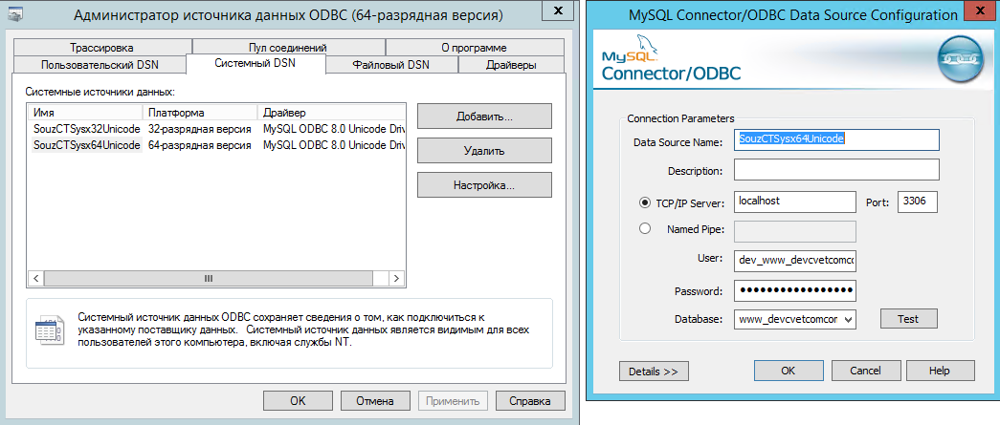

# Адреса обмена данными в базах 1С

## Обмен из Управленки

### Константы

Константа **"Адрес веб сервиса 1C:Документооборот"** (АдресВебСервиса1СДокументооборот). Отправка и получение данных производится из Управленки.

Константа "ВебСервис сервера скидок" (МЦТ_ВебСервисСервераСкидок)

Константа "Учетная запись электронной почты для автоматической отправки отчетов"(МЦТ_УчетнаяЗаписьЭлектроннойПочтыДляАвтоматическойОтправкиОтчетов)

### Настройки обмена данными (типовые)

Адреса ftp:

- ftp3.cvetcom.com (обмен с Узлами)
- 78.47.249.231 (Обмен с Корп базой)

### Управляемые регламентные задания

- 000000013 (Докум-от 2.1. Контрагеты). Обмен через обработку Универсального обмена данных с подключением к базе Документооборота через коннектор v83

- 000000023, 000000024, 000000020. Адреса:
  - www.souzcvettorg.ru
  - portal.ct.main
  - selling.cvetcom.com

- 000000025 (Обмен souzcvettorg.ru SQL).  **Необходим ODBC коннектор для MySQL** на сервере

