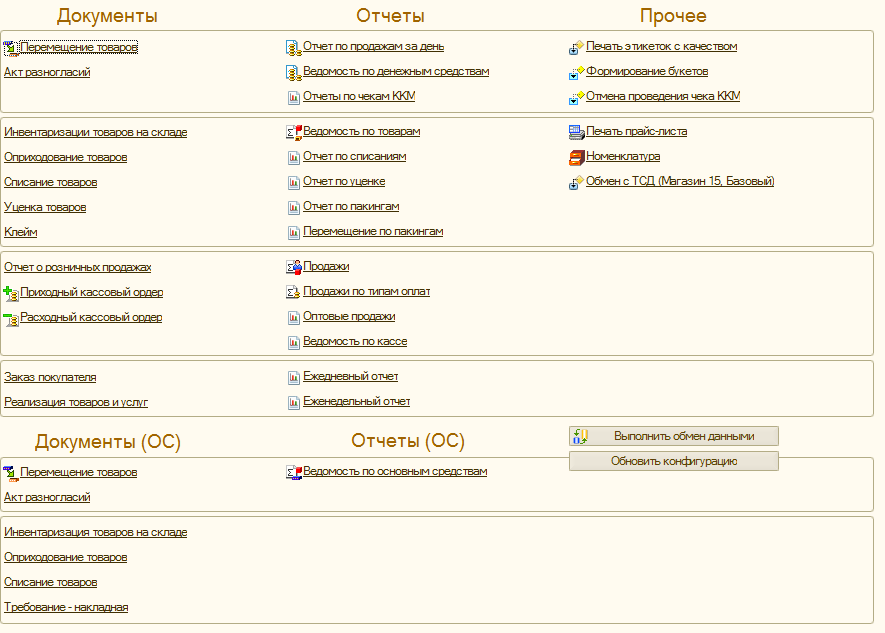

# Доработки по запрещению пробития в минус уцененных позиций

## Конфигурация базы магазина

Переделать (тестировать) все объекты, выведенные на Рабочий стол управляющего

- если цена в разрезе качества отсутствует при пробитии в интерфейсе кассира, то пытаемся автоматически сфорировать цену на уценку из цены на новую позицию * процент уценки

В каждом документе (установка фиксированной цены на качество, отличающимся от Новый):

- при добавлении позиции товара и выборе серии
- форма Подбора
- запретить уходить в минус по уцененным позциям товаров в магазине(* ограничение на уровне записи в регистр)
- отображение остатков товаров **с учетом отложенных чеков** в интерфейсе кассира и новой форме подбора с учетом серии в обработка Подбора товаров
- доработка ролей в конфигурации магазина, при которых управляющему будет запрещено проводить и распроводить документ Уценки, только создавать и записывать непроведенный
- Доработка правил обмена Управленки с УО

---

### Перечисление введенных настроек

#### Реквизиты справочника Склады

1. ДатаНачалаИспользованияНовогоРасчетаБонусов - задействовано с октября 2020 (см. `ИспользуетсяНовыйМеханизмРасчетаБонусов()`). Чтобы не забывать включать, будет сделано автоматическое включение в магазинах, даже если дата в данном реквизите склада не выставлена
2. НачалоУчетаРучныхСкидокВАвтоматических - не используется (см. `РучныеСкидкиУчитываютсяВРасчетеАвтоматических()`)
3. КонтрольОтрицательныхОстатковУценки - не позволяет уходить в минус по уцененным (качество не Новый) позициям в документах товародвижения (см. `ВключенКонтрольУцененныхТоваровУСклада()`)
4. РассчитыватьЦеныПоКачеству - позволяет в магазине автоматически расстывать цены на позиции с качеством не Новый, исходя из "Процента уценки" по текущему качеству, если цены на них отсутствуют в регистре "Цены номенклатуры по качеству" (см. в коде `РассчитыватьЦеныПоКачеству()`)

#### Константы

1. ТипЦенНоменклатурыМагазинов - на данный момент "Розничная 2", если данная константа не заполнена, будет подставлен данный Тип цен. Используется для формирования цен по уцененному качеству товаров
2. СкидкиГруппаУценки - данная константа должна указывать на группу "Уценка" в справончике Скидок, чтобы отключать данную автоматическую скидку при работе новой системы получения цен на позиции номенклатуры с качеством отличным от "Новый" из регистра "Цены номенклатуры по качеству".

---

## Конфигурация отдельного магазина, подключаемого напрямую к удаленке

- установить значение константы ПрямоеПодключениеКУправленке

## Конфиграция Управленки

- генерация всех видов качества при создании номенклатуры, аналогично штрихкодам
- управляемый интерфейс для клеймиста
- управляемые формы для документа Уценки, управляемый интерфейс для клеймиста
- заполнить константу ТипЦенНоменклатурыМагазинов

## Документ Уценки товаров

- в таблице формы документа Уценки цены отображаются (для наглядности), но не хранятся

## Документ Установки цен номенклатуры

- Цены будут формироваться в разрезе качества для вида цены, хранящегося в константе ТипЦенНоменклатурыМагазинов.

## Тестирование

- завести тестовый магазин, со своим складом и т.д.
- **question**: запросить свежую копию Управленки, чтобы занимала меньше места и быстрее реструктуризация проходила и прочее
- наладить обмен между тестовой Управленкой-УО/магазин. УО и Магазин в одной базе
- Режим работы зависит от выставленных констант: РежимРазработчика, РежимРазработчикаТекущийСклад, РежимРазработчикаЭтоМагазин. Ищи в коде: `РежимРазработчикаВключен()`
- проверить работу под пользователями: Кассир, Управляющий, Админ
- тесты ручную или автоматические нужны чтобы задокументировать особенности функционала

## Выполнено

- обновил инструменты разработчика до последней версии в конфигурациях УО и Управленки
- убрал ошибку "-2147221005(0x800401F3): Недопустимая строка с указанием класса" при запуске.
- добавлена форма ВводПараметровССериямиИКачеством обработки ПодборНоменклатуры и флаг ЗапрашиватьКачество в Основой форме данной обработки
- документ Уценки товаров: добавление регистра учета уценки дополнительно в разрезе складов, качества, серий, установка качества для документа уценки, изменение регистра уценки, движения по товарам в рознице
- проверить магазин без установленных констант Разработчика
- внешняя обработка создания серий и ШК в поступлениях была перенесена в конфигурацию
- ограничение ухода в минус по уцененным позициям (с качеством отличающимся от Новый) проверяется через `_ДоработкиСервер.ВключенКонтрольУцененныхТоваровУСклада()`

## После обновления конфигураций

- Управленка: заполнить введеннные константы
- Управленка, УО1, УО2 прогрузить правила обмена новые из КД 2.1 на Гравитсапе
- поменять интерфейс управляющего: внешнюю обработку печати этикеток -> встроенную
- выставить для складов запрет продажи уценки в минус
- Уценку перезаписать

## Инструкции:

1. Создание Серии и ШК из карточки номенклатуры:

> Заходишь в карточку товара, во вкладку штрихкоды, нажимаешь +, заходишь в 3 точки, вбиваешь нужный пакинг в номер гтд и привязываешь к поступлению. Ок. 2 раза щелкаешь на получившейся строчке, она создается во вкладке штрихкоды, затем нажимаешь создать штрихкод.

2. Создание Серии и ШК из документа Поступления:

> В поступлении нажимешь создать, создать серии и штрихкоды, ставишь везде галки, вбиваешь номер серии и гтд, соответствующий поступлению, страну и нажимаешь ок.