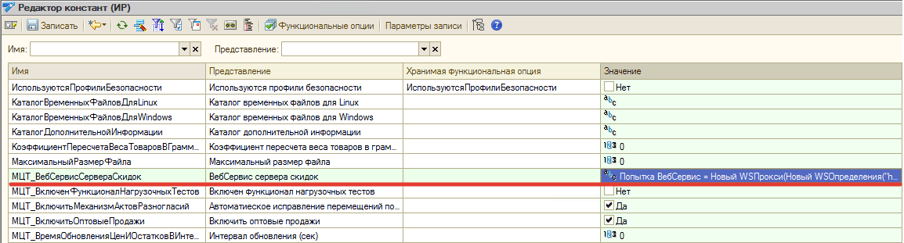
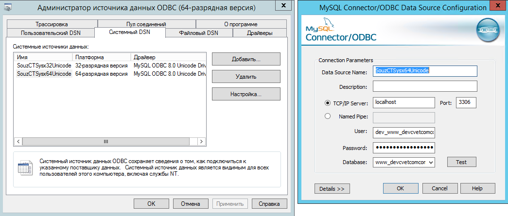
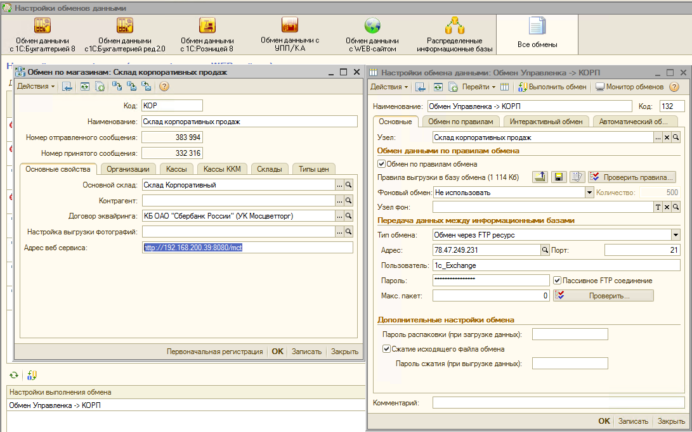
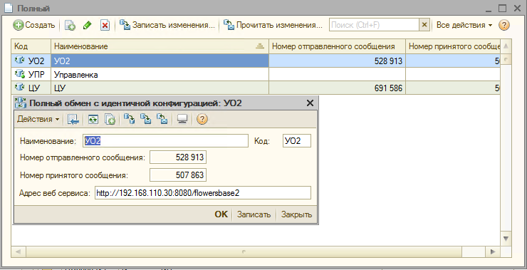
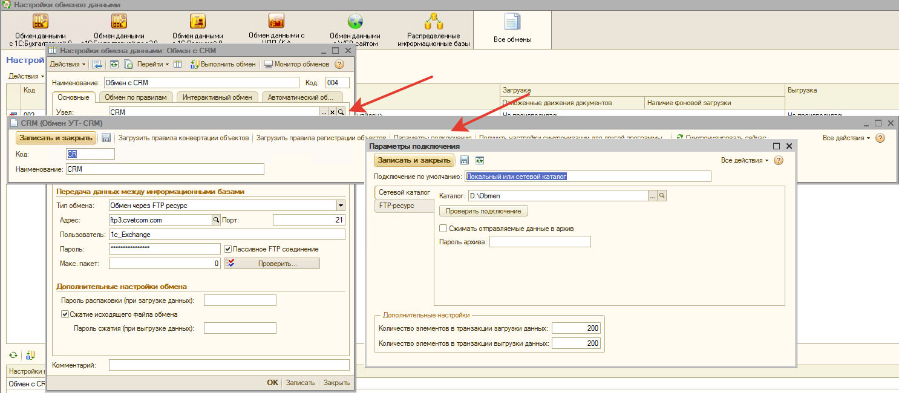

# Адреса обмена данными в базах 1С

## Обмен из Управленки

### Константы

- Константа "Адрес веб сервиса 1C:Документооборот" (АдресВебСервиса1СДокументооборот). Отправка и получение данных производится из Управленки.

- Константа "ВебСервис сервера скидок" (МЦТ_ВебСервисСервераСкидок)
  
  **Важно! Значение данной константы нужно поменять в Узлах обмена и ЦСКА, т.к. из Управленки эта настройка не передается в УО.** Значение данной данной константы, при изменении в узлах, передается в магазины.

Поменять через редактор констант (Инструменты разработчика). Например:

### Настройки обмена данными (типовые)

Адреса ftp:

- ftp3.cvetcom.com (обмен с Узлами)
- 78.47.249.231 (Обмен с Корп базой). Также адрес веб-сервиса прописан в Узле обмена (см. ниже)

### Справочник "Управляемые регламентные задания"

- 000000013 (Докум-от 2.1. Контрагеты). Обмен через обработку Универсального обмена данных с подключением к базе Документооборота через COM-Коннектор v83.
  Регистрация DLL в 64-битной версии Microsoft Windows Server. Библиотека ComConnector comcntr.dll [Легкий способ регистрации библиотеки COMCNTR.DLL (для COM-соединения)](https://infostart.ru/1c/articles/1347969/).

- Коды справочника: 000000020, 000000023, 000000024. Адреса:
  - www.souzcvettorg.ru
  - portal.ct.main
  - selling.cvetcom.com

- 000000025 (Обмен souzcvettorg.ru SQL).  Необходим в ODBC коннектор для MySQL создать настройку в Системные DSN, как на скриншоте, с именем, соответствующим указанному в 1С.

### Узлы обмена (Адреса веб-сервисов)

- Обмен с Корп базой. Указаны настройки как для ftp, так и адрес веб-сервиса

- Обмен с Узлами. Указано:

## Корпоративная база

### Обмен с Табелем

Обмен с Табелем производится через Каталог на диске "D:\Obmen"

